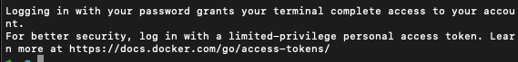

# MSA_Golang

Golang을 활용하여 MSA 구조 서버 만들기

# Architecture


# NewEvent Request Sample

```
{
"name" : "뭐냐",
"duration" : "300s",
"start_date" : 3,
"end_date" : 10,
"location" : {
"name" : "seoul",
"address" : "어디로 찍냐",
"country" : "seoul",
"open_time" : 3,
"close_time" : 3,
"halls" : [
{"name" : "hojin","location" : "house", "capaciry" : 5},
{"name" : "123","location" : "123", "capaciry" : 10000}
]
}
}

```

# openssl을 통해서 개인 인증서 생성

openssl req -x509 -newkey rsa:2048 -nodes keyout key.pem -out cert.pem -days 365

- 간단하게 바로 SSL/TLS인증서를 만드는 명령어 입니다.

1. -x509 : 셀프 서명 인증서를 생성하도록 지정합니다.
2. -newkey res:2048 : RSA알고리즘을 사용하여 2048비트 개인키를 생성합니다.
3. -nodes : 개인키를 암호화하지 않도록 지정합니다. 만약 해당 옵션을 제외하면, 키 생성 후 암호를 지정해야 합니다.
4. -keyout key.pem : 개인키를 `key.pem`으로 생성합니다.
5. -out cert.pem : 셀프 서명 인증서(CSR)을 cert.pem에 지정 합니다.
6. -days 365 : 유효기간을 1년으로 설정합니다.

# docker

1. docker build -t name/repository:tag path

docker를 빌드하는 기본적인 명령어 입니다.

이미지의 이름 + 사용될 레파지토리 + 태그 + 포함할 파일을 입력합니다.

- 예시는 다음과 같습니다.
- docker build -t hojin/msa:1.0 ./
  // 해당 명령어는 로컬에 빌드하는 명령어 입니다.

2. docker push name/repository:tag

해당 명령어는 docker hub에 image를 업로드 하는 명령어 입니다.
기존에 구워낸 -> build해서 이미지가 생성된 이미지를 이제 hub에 업로드 하게 됩니다.

# Jenkins

Jenkins에서 github나 EC에 접근하기 위해서 SSH를 사용할 것이고 다음과 같은 명령어로 생성 하면 됩니다.

- ssh-keygen -t ed25519 -a 100 -f jenkins-ssh-key

해당 명령어로 key를 두가지 생성해 줍니다.

- \*.pub => public Key
- 나머지 => private Key

그러면 이제 Jenkins에는 private Key를 등록해 두고, Github에는 Public Key를 등록하게 된다면 서로 암호화 통신이 가능합니다.

- Github의 경우에는 settings 에서 Deply Keys에 등록

Jenkins의 경우에는 Credentials페이지로 접속하여 Private Key를 등록하면 됩니다.


그 후 AWS에서 사용한 Key를 등록해 주어야 합니다.

- 플러그인이 제대로 설치되어 있다면 Jenkins관리 -> AWS에서 추가하는 Modal을 띄워줍니다.


그 후 `Kind`부분만 `AWS Credentials`로 설정해주고 나머지 값은 편하게 입력해 줍니다.

- AccessKey는 사용중인 IAM의 accessKey를 넣어주면 됩니다.

그러면 현재까지 두개의 Key를 등록하였습니다.

1. Github와 Jenkins를 연결하기 위한 Key
2. ECR과 Jenkins를 등록하기 위한 Key

마지막으로 Jenkins과 EC2에 사용할 Key를 마지막으로 등록해 주면 됩니다.


1. Github에 대한 Key
2. AWS에 대한 Key
3. Jenkins & EC2사이의 Key

# ECR

저는 docker hub가 아닌 ECR을 사용을 하였습니다.

기본적으로 aws cli를 설치해야 합니다.

- 그 후 aws --version을 통해서 확인합니다.

그 후 초기 설정 aws configure를 통해서 사용자를 설정해 주어야 합니다.

- 입력값으로 IAM의 Access Key를 입력하게 되어 있습니다.
- 그러기 떄문에 적합한 값을 입력해 주면 됩니다.
- Region은 서울인 `ap-northeast-2`로 설정해 줍니다.
- 마지막으로 format은 모두가 익숙한 json으로 설정합니다.

이후 기본적으로 인증 토큰을 설정해 주어야 합니다.

- 해당 과정은 ECR에 접근하여 `푸시 명령 보기`에 있는 cli를 그대로 입력해 주면 됩니다.
- 예시는 다음과 같습니다.
- `aws ecr get-login-password --region ap-southeast-2 | docker login --username AWS --password-stdin <AWS 12자리 계정>.dkr.ecr.ap-southeast-2.amazonaws.com`

문제 없이 성공한다면 다음과 같은 문구가 뜹니다.


